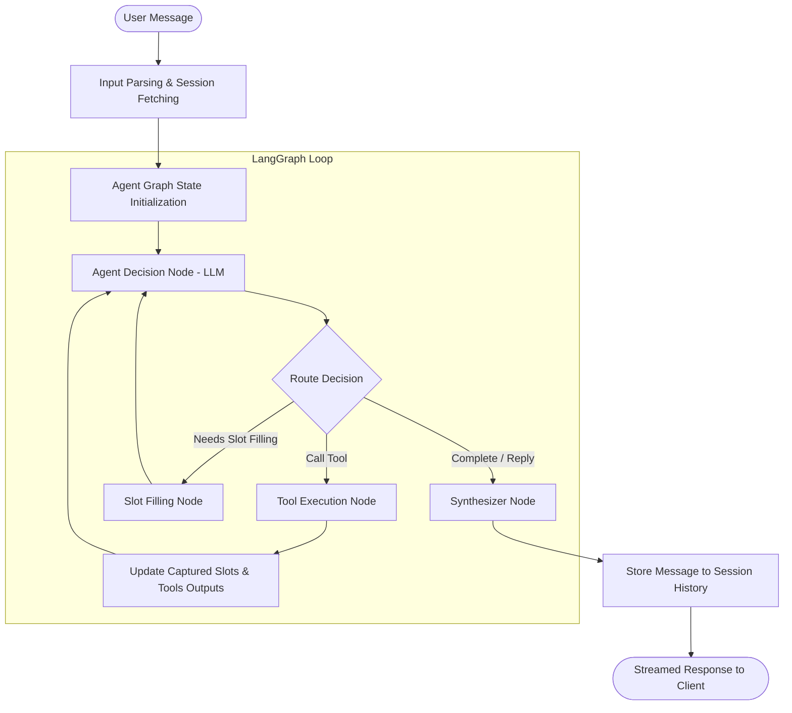

# AI Agent Architecture: AI Smart Campus Event Registration Agent

This document details the modular and stateful architecture of the conversational AI Agent built for campus event management. The system is designed to provide a natural, ChatGPT-like conversation style while retaining strict operational rules, guardrails, and deterministic tool usage.

---

## Part 1: Agent Tools Specification

The AI Agent relies on a suite of function-calling tools to query database state, execute mutations, and access context. Below is the specification for each of the 9 required tools.

---

### 1. Search Events (`search_events`)
* **Purpose:** Allows the agent to find events based on user preferences, keywords, dates, categories, or venues using semantic vector search and metadata filters.
* **Input Schema:**
  * `query` (string, optional): Semantic query string (e.g., "coding workshops").
  * `category` (string, optional): Event type filter (`workshop`, `seminar`, `sports`, `cultural`).
  * `start_date` (string, optional): ISO 8601 start date boundary.
  * `end_date` (string, optional): ISO 8601 end date boundary.
  * `venue` (string, optional): Filter by location.
* **Output Schema:**
  * `status` (string): `success` or `no_results`.
  * `events` (array of objects): `[{id, title, category, venue, start_time, capacity_status, short_description}]`.
* **Backend API Used:** `GET /api/v1/events` (with query parameters and optional semantic vector payload).
* **MongoDB Collections Used:** `events` (utilizing a Vector Search index on the `embedding` field and compound indexes on `category` and `start_time`).
* **Example Conversation:**
  * *User:* "Are there any tech events happening this weekend?"
  * *Agent:* [Calls `search_events(query="tech", start_date="2026-07-04T00:00:00Z", end_date="2026-07-05T23:59:59Z")`]
  * *Tool Response:* `{status: "success", events: [{id: "e101", title: "WebDev Hackathon", venue: "Lab 3", start_time: "2026-07-04T09:00:00Z", capacity_status: "Open"}]}`
  * *Agent:* "Yes! The 'WebDev Hackathon' is happening this Saturday, July 4th, at 9:00 AM in Lab 3. Registrations are currently open. Would you like me to register you for it?"
* **Possible Errors:**
  * Vector index synchronization lag (returns outdated listings).
  * Malformed date strings parsed by the LLM.
  * No matching events found (requires agent fallback to suggest upcoming general events).

---

### 2. Register for Event (`register_for_event`)
* **Purpose:** Handles the final step of registering a student for a specific campus event after validating prerequisites and collecting required custom form fields.
* **Input Schema:**
  * `student_id` (string): The unique identifier of the student.
  * `event_id` (string): The unique identifier of the event.
  * `custom_fields_responses` (object, optional): Key-value pairs satisfying the event’s specific registration questions (e.g., `{"t_shirt_size": "M"}`).
* **Output Schema:**
  * `status` (string): `registered` or `pending` or `failed`.
  * `registration_id` (string): Unique ID of the registration record.
  * `ticket_code` (string): Cryptographically secure verification hash.
  * `message` (string): Details regarding confirmation or failure reasons.
* **Backend API Used:** `POST /api/v1/registrations`
* **MongoDB Collections Used:** `registrations` (inserts new document), `events` (increments `registered_count` atomically using `$inc`).
* **Example Conversation:**
  * *User:* "Sign me up for the WebDev Hackathon. My t-shirt size is Medium."
  * *Agent:* [Calls `register_for_event(student_id="s99", event_id="e101", custom_fields_responses={"t_shirt_size": "M"})`]
  * *Tool Response:* `{status: "registered", registration_id: "r551", ticket_code: "TX-99881", message: "Success"}`
  * *Agent:* "You're registered! I've reserved your spot for the WebDev Hackathon. Your ticket code is TX-99881, and a copy has been emailed to you."
* **Possible Errors:**
  * Event capacity exceeded during the transactional registration window.
  * Student is already registered (returns duplicate key error).
  * Missing required custom fields responses (handled by agent slot-filling node prior to execution).

---

### 3. Cancel Registration (`cancel_registration`)
* **Purpose:** Cancels an active registration for an event, releasing the slot back to the event capacity pool.
* **Input Schema:**
  * `student_id` (string): Unique identifier of the student.
  * `event_id` (string): Unique identifier of the event.
* **Output Schema:**
  * `status` (string): `cancelled` or `error`.
  * `message` (string): Clarification of the outcome.
* **Backend API Used:** `PUT /api/v1/registrations/cancel`
* **MongoDB Collections Used:** `registrations` (updates status to `cancelled`), `events` (decrements `registered_count` atomically).
* **Example Conversation:**
  * *User:* "Actually, I won't be able to make it to the WebDev Hackathon. Can you cancel my ticket?"
  * *Agent:* [Calls `cancel_registration(student_id="s99", event_id="e101")`]
  * *Tool Response:* `{status: "cancelled", message: "Registration cancelled successfully"}`
  * *Agent:* "No problem. I have cancelled your registration for the WebDev Hackathon. The spot has been released, and your ticket is now void."
* **Possible Errors:**
  * Registration record not found (e.g., student was never registered).
  * Cancellation requested after the event's lock-out deadline (e.g., less than 2 hours before the start).

---

### 4. View Registered Events (`view_registered_events`)
* **Purpose:** Retrieves a list of active and historical event registrations for the currently authenticated student.
* **Input Schema:**
  * `student_id` (string): Unique identifier of the student.
  * `status_filter` (string, optional): Filter by ticket status (`registered`, `checked_in`, `cancelled`).
* **Output Schema:**
  * `status` (string): `success` or `empty`.
  * `registrations` (array of objects): `[{registration_id, event_title, start_time, venue, ticket_code, ticket_status}]`.
* **Backend API Used:** `GET /api/v1/registrations/my-tickets`
* **MongoDB Collections Used:** `registrations` (queries by `student_id` and aggregates details from `events` collection).
* **Example Conversation:**
  * *User:* "What events am I currently signed up for?"
  * *Agent:* [Calls `view_registered_events(student_id="s99", status_filter="registered")`]
  * *Tool Response:* `{status: "success", registrations: [{registration_id: "r551", event_title: "WebDev Hackathon", start_time: "2026-07-04T09:00:00Z", venue: "Lab 3", ticket_code: "TX-99881", ticket_status: "registered"}]}`
  * *Agent:* "You have one upcoming event: the 'WebDev Hackathon' on Saturday, July 4th, at 9:00 AM in Lab 3. Your ticket code is TX-99881."
* **Possible Errors:**
  * Database retrieval failure due to connection timeouts.
  * Empty response if the student has no active registrations.

---

### 5. Recommend Events (`recommend_events`)
* **Purpose:** Generates customized event recommendations based on the student's profile (skills, interests, department) and past registrations using vector matching.
* **Input Schema:**
  * `student_id` (string): Unique identifier of the student.
  * `limit` (integer, optional): Maximum number of recommendations to return.
* **Output Schema:**
  * `status` (string): `success` or `no_recommendations`.
  * `recommendations` (array of objects): `[{id, title, category, match_score, short_reason}]`.
* **Backend API Used:** `GET /api/v1/users/{student_id}/recommendations`
* **MongoDB Collections Used:** `users` (to read interests/past behaviors), `events` (for vector similarities calculations against student profile preferences).
* **Example Conversation:**
  * *User:* "Can you recommend any cool clubs or events for me?"
  * *Agent:* [Calls `recommend_events(student_id="s99", limit=2)`]
  * *Tool Response:* `{status: "success", recommendations: [{id: "e205", title: "Introduction to AI & Neural Networks", category: "workshop", match_score: 0.92, short_reason: "Matches your interest in Artificial Intelligence and Python"}]}`
  * *Agent:* "Based on your interest in AI and Python, I highly recommend the 'Introduction to AI & Neural Networks' workshop. It matches your profile by 92%. Would you like more details?"
* **Possible Errors:**
  * Incomplete student profile (requires agent to prompt user for interests first).
  * Lack of events in the database yielding low match scores.

---

### 6. Event FAQ (`event_faq`)
* **Purpose:** Performs a RAG lookup on the knowledge base (flyers, FAQs, rules, guidelines) of a specific event to answer administrative or logistical questions.
* **Input Schema:**
  * `event_id` (string): Target event ID.
  * `user_question` (string): The natural language query from the student.
* **Output Schema:**
  * `status` (string): `found` or `not_found`.
  * `context_blocks` (array of strings): High-relevance snippets retrieved from the FAQ index.
* **Backend API Used:** `GET /api/v1/events/{event_id}/faq?q={user_question}`
* **MongoDB Collections Used:** `events` (queries the embedded vector arrays inside the `faqs` schema properties using vector search).
* **Example Conversation:**
  * *User:* "Do I need to bring food to the WebDev Hackathon, or is lunch provided?"
  * *Agent:* [Calls `event_faq(event_id="e101", user_question="Is lunch provided?")`]
  * *Tool Response:* `{status: "found", context_blocks: ["Free lunch, snacks, and coffee will be provided to all registered participants at 1:00 PM in the adjoining lounge."]} `
  * *Agent:* "Yes, lunch is provided! Free lunch, snacks, and coffee will be served to all participants at 1:00 PM in the adjoining lounge."
* **Possible Errors:**
  * Empty context blocks if organizers haven't uploaded comprehensive FAQ text.
  * Irrelevant semantic retrieval mapping if the search query is too vague.

---

### 7. Event Schedule Lookup (`event_schedule_lookup`)
* **Purpose:** Fetches the schedule matrix, session sequence, speakers, or timetable of a specific event.
* **Input Schema:**
  * `event_id` (string): Unique identifier of the target event.
* **Output Schema:**
  * `status` (string): `success` or `no_schedule_listed`.
  * `timeline` (array of objects): `[{time_slot, title, description, speaker}]`.
* **Backend API Used:** `GET /api/v1/events/{event_id}/schedule`
* **MongoDB Collections Used:** `events` (reads the dynamic `schedule` field structure of the document).
* **Example Conversation:**
  * *User:* "What is the schedule for the WebDev Hackathon?"
  * *Agent:* [Calls `event_schedule_lookup(event_id="e101")`]
  * *Tool Response:* `{status: "success", timeline: [{time_slot: "09:00 AM - 10:00 AM", title: "Opening Ceremony", speaker: "Dr. Smith"}, {time_slot: "10:00 AM - 01:00 PM", title: "Hacking Session 1", speaker: "All"}]}`
  * *Agent:* "Here is the schedule for the WebDev Hackathon:\n- **09:00 AM - 10:00 AM**: Opening Ceremony (Speaker: Dr. Smith)\n- **10:00 AM - 01:00 PM**: Hacking Session 1\nLet me know if you need to know about parking or other sessions!"
* **Possible Errors:**
  * Schedule details not finalized by the organizer.
  * Timezone mismatches between local time and database storage formats.

---

### 8. Student Profile Lookup (`student_profile_lookup`)
* **Purpose:** Retrieves the current student profile details to determine academic year, interests, skills, department, or missing configuration details.
* **Input Schema:**
  * `student_id` (string): Unique identifier of the student.
* **Output Schema:**
  * `status` (string): `success` or `not_found`.
  * `profile` (object): `{full_name, email, department, academic_year, skills, interests}`.
* **Backend API Used:** `GET /api/v1/users/{student_id}`
* **MongoDB Collections Used:** `users` (reads document by primary key).
* **Example Conversation:**
  * *User:* "Check if my profile information is correct."
  * *Agent:* [Calls `student_profile_lookup(student_id="s99")`]
  * *Tool Response:* `{status: "success", profile: {full_name: "John Doe", email: "j.doe@campus.edu", department: "Computer Science", academic_year: 3, skills: ["Python"], interests: ["AI", "Web Dev"]}}`
  * *Agent:* "According to my records, you are John Doe, a 3rd-year Computer Science student. Your listed skills include Python, and your interests are AI and Web Dev. Is everything correct?"
* **Possible Errors:**
  * Account exists in authentication but does not have a matching user profile record in the database collection.
  * Access violation errors if attempting to lookup other student accounts.

---

### 9. Event Availability Checker (`check_event_availability`)
* **Purpose:** Verifies if a specific event is active, has remaining seats, and determines if the student meets all registration eligibility requirements.
* **Input Schema:**
  * `event_id` (string): Unique identifier of the event.
  * `student_id` (string): Unique identifier of the student (used for checking pre-requisites or role restrictions).
* **Output Schema:**
  * `status` (string): `available` or `full` or `ineligible`.
  * `remaining_capacity` (integer): Remaining ticket count.
  * `reason` (string, optional): Message outlining restriction reasons.
* **Backend API Used:** `GET /api/v1/events/{event_id}/availability?student_id={student_id}`
* **MongoDB Collections Used:** `events` (checks capacities and dynamic criteria filters), `registrations` (counts matching records).
* **Example Conversation:**
  * *User:* "Can I still register for the Python workshop?"
  * *Agent:* [Calls `check_event_availability(event_id="e102", student_id="s99")`]
  * *Tool Response:* `{status: "available", remaining_capacity: 5}`
  * *Agent:* "Yes! The Python workshop is still open for registration. There are currently 5 seats remaining, and you meet the prerequisites. Would you like to reserve your spot now?"
* **Possible Errors:**
  * Race conditions where remaining capacity becomes outdated during active browsing.
  * Complex rules evaluation failures (e.g., student major is not listed in the event's database whitelist).

---

## Part 2: AI Agent System Architecture Design



---

### 1. LangGraph Workflow

The LangGraph system handles the flow of conversation through deterministic states and dynamic routing. It consists of the following key nodes and control pathways:

* **Nodes:**
  1. **`Fetch Session & Profile Node`:** Retrieves historical conversation context and student profile at graph instantiation.
  2. **`LLM Agent Core Node`:** Evaluates state parameters and generates either a tool request list, a slot request message, or the final response text.
  3. **`Tool Call Node`:** Parses tool calls requested by the model and maps them to their respective backend API operations.
  4. **`Slot-Filling validation Node`:** Evaluates user inputs against event schemas if the agent is executing a registration process.
  5. **`Response Synthesizer Node`:** Formulates the final conversational message back to the user, mapping JSON tool inputs/outputs to student-friendly language.
* **Conditional Edges:**
  * **`router`:** Decides if the model wants to call a tool, requires missing inputs (slots), or is ready to speak to the user.
  * **`availability_gate`:** If a user requests registration, the graph branches to run the `check_event_availability` tool automatically before entering the data collection phase.

---

### 2. State Management

The core state of the agent is modeled as a unified class containing message threads, intermediate extraction states, and operational values.

* **Unified State Variables:**
  * `messages` (list): The rolling history of system, user, assistant, and tool messages.
  * `current_intent` (string): The active parsed intent (e.g., `event_registration`).
  * `active_event_context` (object): Tracks the database details of the event the user is interacting with.
  * `missing_registration_slots` (list of strings): Tracks required fields not yet provided by the user.
  * `form_responses` (dict): Temporary storage for slots collected during a multi-turn registration process.
  * `session_user` (object): Cache containing basic authenticated student information.
* **State Updates:**
  * Conversational turns append messages to `messages`.
  * If the classifier assigns `current_intent = "register"`, `active_event_context` is populated. The `registration_fields` configuration array from the event document is loaded, and fields are subtracted dynamically as the user provides answers.

---

### 3. Memory

To behave like ChatGPT, the system implements a dual-layer memory system:

* **Short-Term Memory (Conversational State):**
  * Maintains state within a single session using LangGraph's native thread persistence.
  * Stores message history to parse coreferences (e.g., *User: "Is it free?"* -> *Agent knows "it" refers to the previously searched "WebDev Hackathon"*).
* **Long-Term Memory (User & Profile Context):**
  * Hydrates at session startup by looking up the user ID in the `users` collection.
  * Reads the student's department, interests, and registration history.
  * This details are appended to the agent's context window, allowing recommendations without the user re-introducing themselves.

---

### 4. Prompt Design

The system relies on structured system prompts that separate persona instructions from operational limits.

* **System Prompt Components:**
  * **Persona & Tone:** Friendly campus concierge. Professional, direct, encouraging student involvement.
  * **Role Constraints:** Strictly refuse to answer general non-campus questions (e.g., writing essays or general coding help). Focus exclusively on campus navigation and event organization.
  * **Tool Execution Rules:** Do not guess database values. Use `search_events` if unsure about details. Always verify event availability with `check_event_availability` prior to registering.
* **Contextual Variables (Injected at Runtime):**
  * `current_time`: ISO string ensuring the agent knows which days represent "tomorrow", "this weekend", or "past events".
  * `student_profile`: Injected profile details so the agent can personalize recommendations dynamically.
  * `pending_fields`: List of details still missing for active registration processing.

---

### 5. Tool Calling Process

Function-calling behaves deterministically to prevent hallucinated tool executions.

1. **Schema Definition:** Tools are defined with explicit JSON validation schemas using Python Pydantic classes (which Gemini parses natively).
2. **LLM Extraction:** The agent processes the user message. If a tool call matches, the LLM emits a tool call payload (e.g., `{"name": "search_events", "arguments": {"query": "coding"}}`).
3. **Execution Routing:** The LangGraph `Tool Node` intercepts the message, performs validations (e.g. JWT validations), calls the corresponding FastAPI route, and returns the result as a `tool` role message.
4. **State Feedback Loop:** The result is appended to the LangGraph thread state. The agent core runs again, processing the tool response to speak to the student.

---

### 6. Agent Decision Making

The agent uses a structured reasoning cycle (ReAct pattern) to achieve user goals.

```
       +---------------------------------------------+
       |   User Message: "Sign me up for coding"     |
       +---------------------------------------------+
                              |
                              v
       +---------------------------------------------+
       |             Agent Core (LLM)                |
       |  - Recognizes intent: Register              |
       |  - Missing parameters: Which coding event?  |
       +---------------------------------------------+
                              |
                     [Router Decision]
                              |
             +----------------+----------------+
             |                                 |
     (Event Identified?)               (No Event Found)
             |                                 |
             v                                 v
   +--------------------+            +--------------------+
   | Retrieve Event FAQ |            | Call Search Event  |
   | & Registration Form|            |    Tool Node       |
   +--------------------+            +--------------------+
```

* **Handling Multi-step Queries:**
  If a student says: *"I want to sign up for the web design workshop if there are still tickets"*, the agent makes a series of decisions:
  1. Call `search_events` to retrieve the event matching "web design".
  2. Map the ID, then call `check_event_availability` to confirm remaining seats.
  3. If seats are available, check if the event requires registration forms. If not, call `register_for_event`. If yes, output questions to collect the missing data.
* **State Verification Guardrails:**
  The agent cannot write directly to registration databases without validation. The agent must verify that the output of `check_event_availability` returns `status: "available"` before formatting a payload for `register_for_event`.

---

### 7. Future Improvements

To transition the system from a prototype to a campus-wide assistant, the following patterns can be implemented:

* **Reflect & Critique Pattern:**
  Introduce a self-correction node after generating tool payloads. If the model attempts to generate a registration call for an event the user hasn't explicitly selected, a validation node triggers a prompt rewrite, prompting the model to seek confirmation first.
* **Human-in-the-Loop (HITL) Gateways:**
  If the student tries to register for an event that has reached full capacity, the agent can submit a request to a waitlist system. The organizer dashboard can review these requests and approve overriding capacity exceptions. The agent waits on a state-machine release lock before confirming registration.
* **Multi-Agent Orchestration:**
  Split the agent into a router and three subagents:
  1. *Discovery Agent:* Specializes in vector queries, search filtering, and calendar schedule lookups.
  2. *Registration Agent:* Structured slot-filler agent managing transactional sign-ups and ticket distribution.
  3. *FAQ Assistant:* Specializes in fetching documents and running QA RAG matching on club handbooks and event briefs.
