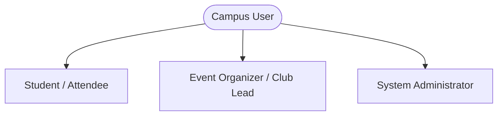
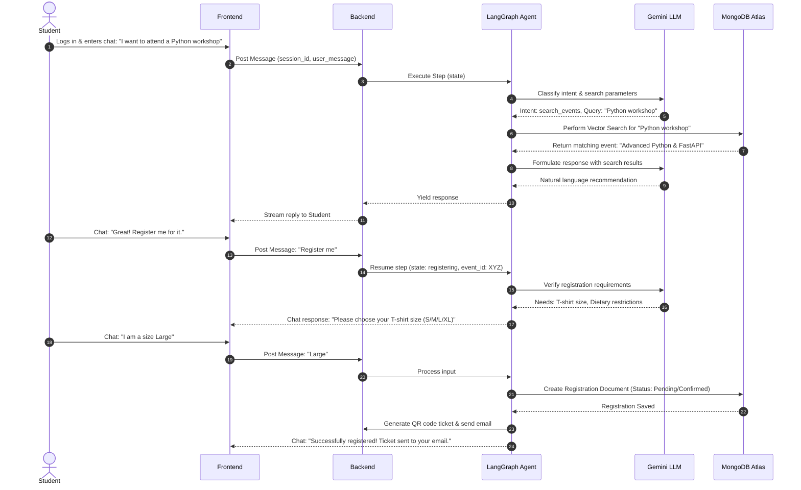
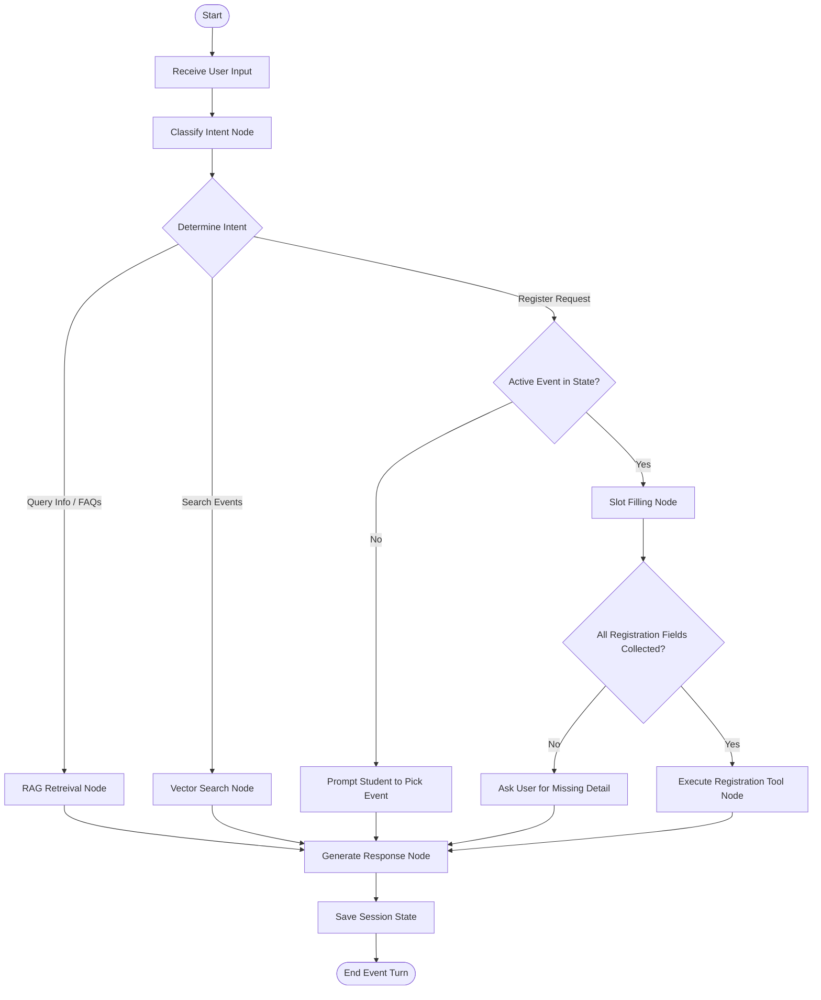

# Systems Architecture Document: AI Smart Campus Event Registration Agent

This document defines the comprehensive architectural design for the **AI Smart Campus Event Registration Agent**. It is designed as a modular, scalable, and production-ready system suitable for a final-year engineering project.

---

## 1. Project Overview

The **AI Smart Campus Event Registration Agent** is an intelligent, conversational system designed to streamline event discovery, registration, and inquiry management on a college campus. 

Unlike traditional, form-heavy registration web apps, this project leverages a **Stateful AI Agent (LangGraph)** powered by the **Google Gemini API** to offer a conversational interface. Students can discover events, check schedules, clarify doubts, and register for events through natural language dialogue. Organizers and administrators are provided with a dedicated analytics dashboard to manage events and monitor student engagement.

---

## 2. Problem Statement

Campus events (seminars, workshops, cultural festivals, sports, club meets) are vital to student life, but they suffer from significant operational challenges:
* **Information Fragmentation:** Events are advertised across disjointed channels (Slack, WhatsApp, physical flyers, emails), making discovery difficult.
* **Registration Friction:** Filling out complex, repetitive Google Forms or web forms causes user drop-off.
* **Support Bottlenecks:** Organizers are overwhelmed by repetitive queries regarding event timing, eligibility, venue changes, and prerequisites.
* **Lack of Personalization:** Students miss out on relevant workshops or club activities because there is no recommendation system matching their interests or academic profile.
* **Manual Check-ins:** Paper-based or manual spreadsheet-based check-ins at venues lead to long queues and human error.

---

## 3. Objectives

* **Conversational Interface:** Provide a single conversational portal for students to find and register for events.
* **AI-Powered Event Discovery:** Offer context-aware recommendations based on student profiles and previous registrations.
* **Automated FAQ Resolution:** Offload queries from organizers by using a RAG (Retrieval-Augmented Generation) system to answer event-related questions.
* **Streamlined Check-ins:** Implement secure, QR-code-based ticket generation and validation.
* **Centralized Organizer Panel:** Equip event planners with tools to create events, send updates, and view real-time attendance analytics.
* **Robust Agent Architecture:** Utilize LangGraph to maintain stateful, multi-turn conversations and safely handle complex branching logic.

---

## 4. User Roles



### 4.1. Student / Attendee
* **Discover:** Searches for events via natural language queries (e.g., *"Find me hackathons next weekend"*).
* **Interact:** Asks questions about event details, eligibility, prerequisites, and timings.
* **Register:** Signs up for events through chat; receives tickets and confirmation details.
* **Manage:** Views registered events, cancels registrations, and accesses QR-code tickets.

### 4.2. Event Organizer / Club Lead
* **Create & Edit:** Publishes event details, upload flyers, and sets ticket capacities.
* **Manage Registrations:** Views lists of attendees and exports data.
* **Validate Attendance:** Scans attendee QR codes at the venue using a mobile-friendly dashboard.
* **Analyze:** Views attendance rates, feedback, and student interest metrics.

### 4.3. System Administrator
* **Manage Users:** Oversees user accounts and role assignments.
* **Moderate Events:** Reviews and approves events submitted by clubs.
* **System Health Monitoring:** Accesses system logs and performance analytics.

---

## 5. Functional Requirements

### 5.1. User Authentication & Profile Management
* OAuth2 authentication with campus email credentials (or Google OAuth).
* Profile registration capturing department, year, skills, interests, and dietary preferences.

### 5.2. Conversational Event Agent
* Stateful, multi-turn chat workspace.
* NLP-based event search, filtering, and reservation.
* Context-aware slot-filling for registration (e.g., asking for t-shirt size or programming language preference if the event requires it).

### 5.3. RAG-Based Event FAQ System
* Instant answers to questions like *"Is lunch provided at the React workshop?"* or *"Do I need to bring my own laptop?"* based on stored event documentation.

### 5.4. QR-Code Ticketing & Attendance System
* Automatic generation of a signed, tamper-proof QR code upon registration.
* Ticket delivery via email and the web application interface.
* Dashboard-integrated scanner to log check-ins in real-time.

### 5.5. Organizer Dashboard & Analytics
* Metrics on registration counts, page views, check-in conversion rates, and demographic breakdowns (e.g., attendance by department).

---

## 6. Non-Functional Requirements

### 6.1. Scalability
* **Backend:** Stateless FastAPI microservices that can scale horizontally.
* **Database:** MongoDB Atlas to handle document storage with auto-sharding and indexing.

### 6.2. Latency & Performance
* Conversational responses delivered within $< 1.5$ seconds.
* Streaming API responses for the AI agent to reduce perceived latency.
* Optimized vector search for fast discovery queries.

### 6.3. Security & Compliance
* **Data Encryption:** HTTPS for data in transit; AES-256 for sensitive database fields.
* **Token Auth:** Secure JSON Web Tokens (JWT) stored in HTTP-only cookies.
* **Access Control:** Role-Based Access Control (RBAC) separating Students, Organizers, and Admins.

### 6.4. Reliability & Availability
* Up-time target of 99.9%.
* Robust fallback states for the AI agent if the LLM provider experiences downtime or API limits are hit.

---

## 7. AI Features

* **Intent Recognition & Slot Filling:** Analyzes natural language messages to extract user intents (e.g., `search_event`, `register`, `ask_question`) and parameters (e.g., `date`, `category`).
* **Semantic Event Search:** Uses vector embeddings generated by Google Gemini to match search queries to events based on semantic meaning rather than exact keywords.
* **Automated Event Document Ingestion:** When an organizer uploads an event description or flyer, Gemini extracts structured event metadata (title, date, location, registration fields) and saves it.
* **Contextual Conversations (LangGraph):** Manages conversational state, tracking whether the user is in the middle of a registration process, searching for events, or asking a generic question.

---

## 8. Complete User Journey



---

## 9. System Architecture Diagram

```
+---------------------------------------------------------------------------------+
|                                 FRONTEND                                        |
|  +-------------------------------------+   +---------------------------------+  |
|  |             Vite + React            |   |           Tailwind CSS          |  |
|  |   - Chat Interface (Streaming UI)   |   |   - Premium Responsive Layout   |  |
|  |   - Organizer Dashboard & Charts    |   |   - Glassmorphism Components    |  |
|  |   - QR Code Ticket View & Scanner   |   |   - Dynamic Micro-animations    |  |
|  +-------------------------------------+   +---------------------------------+  |
+----------------------------------------+----------------------------------------+
                                         |
                                         | HTTP / WebSockets (JSON, JWT)
                                         v
+---------------------------------------------------------------------------------+
|                                 BACKEND (FastAPI)                               |
|  +---------------------------------------------------------------------------+  |
|  |                            API ROUTER / CONTROLLERS                       |  |
|  |   - /auth   - /users   - /events   - /registrations   - /chat   - /admin  |  |
|  +--------------------------------------+------------------------------------+  |
|                                         |                                       |
|                                         v                                       |
|  +---------------------------------------------------------------------------+  |
|  |                           LANGGRAPH AI AGENT                              |  |
|  |   - Stateful Conversation Graph (State, Nodes, Conditional Edges)         |  |
|  |   - Tool Binding (Vector Search, Registration Tool, Event Details Tool)   |  |
|  +---------------------+-------------------+---------------------------------+  |
|                        |                   |                                    |
+------------------------+-------------------+------------------------------------+
                         |                   |
        Vector & CRUD Ops|                   | API Requests (Embeddings, Chat)
                         v                   v
+----------------------------------+   +------------------------------------------+
|       DATABASE (MongoDB Atlas)   |   |                AI ENGINE                 |
|   - Users & Sessions             |   |            Google Gemini API             |
|   - Events Schema                |   |   - gemini-1.5-flash (Inference/RAG)     |
|   - Vector Search Indexes        |   |   - text-embedding-004 (Embeddings)      |
|   - Registrations & Check-ins    |   +------------------------------------------+
+----------------------------------+
```

---

## 10. Frontend Folder Structure

```
ai-campus-agent-frontend/
├── public/
│   └── favicon.ico
├── src/
│   ├── assets/
│   │   ├── images/
│   │   └── logos/
│   ├── components/
│   │   ├── common/
│   │   │   ├── Button.jsx
│   │   │   ├── Card.jsx
│   │   │   ├── Input.jsx
│   │   │   ├── Loader.jsx
│   │   │   └── Navbar.jsx
│   │   ├── chat/
│   │   │   ├── ChatBubble.jsx
│   │   │   ├── ChatInput.jsx
│   │   │   ├── ChatWindow.jsx
│   │   │   └── TypingIndicator.jsx
│   │   ├── dashboard/
│   │   │   ├── AnalyticsSummary.jsx
│   │   │   ├── AttendanceChart.jsx
│   │   │   └── EventListTable.jsx
│   │   └── events/
│   │       ├── EventCard.jsx
│   │       ├── EventGrid.jsx
│   │       └── TicketModal.jsx
│   ├── context/
│   │   ├── AuthContext.jsx
│   │   └── ChatContext.jsx
│   ├── hooks/
│   │   ├── useAuth.js
│   │   ├── useChat.js
│   │   └── useScanner.js
│   ├── layouts/
│   │   ├── DashboardLayout.jsx
│   │   └── MainLayout.jsx
│   ├── pages/
│   │   ├── ChatPage.jsx
│   │   ├── DashboardPage.jsx
│   │   ├── EventDetailPage.jsx
│   │   ├── LandingPage.jsx
│   │   ├── LoginPage.jsx
│   │   ├── RegisterPage.jsx
│   │   └── TicketScannerPage.jsx
│   ├── services/
│   │   ├── api.js
│   │   ├── auth.js
│   │   ├── chat.js
│   │   └── events.js
│   ├── utils/
│   │   ├── constants.js
│   │   └── helpers.js
│   ├── App.css
│   ├── App.jsx
│   ├── index.css
│   └── main.jsx
├── index.html
├── package.json
├── postcss.config.js
├── tailwind.config.js
└── vite.config.js
```

---

## 11. Backend Folder Structure

```
ai-campus-agent-backend/
├── app/
│   ├── api/
│   │   ├── v1/
│   │   │   ├── endpoints/
│   │   │   │   ├── auth.py
│   │   │   │   ├── chat.py
│   │   │   │   ├── events.py
│   │   │   │   ├── registrations.py
│   │   │   │   └── users.py
│   │   │   └── api.py
│   │   └── deps.py
│   ├── core/
│   │   ├── config.py
│   │   ├── database.py
│   │   ├── security.py
│   │   └── exceptions.py
│   ├── models/
│   │   ├── user.py
│   │   ├── event.py
│   │   ├── registration.py
│   │   └── chat.py
│   ├── schemas/
│   │   ├── user.py
│   │   ├── event.py
│   │   ├── registration.py
│   │   └── chat.py
│   ├── services/
│   │   ├── gemini.py
│   │   ├── qrcode.py
│   │   └── mailer.py
│   ├── agent/
│   │   ├── state.py
│   │   ├── nodes.py
│   │   ├── edges.py
│   │   ├── tools.py
│   │   └── graph.py
│   └── main.py
├── tests/
│   ├── conftest.py
│   ├── test_auth.py
│   ├── test_chat.py
│   └── test_events.py
├── .env.example
├── .gitignore
├── Dockerfile
├── README.md
├── requirements.txt
└── vercel.json
```

---

## 12. Database Collections (MongoDB Atlas)

### 12.1. `users` Collection
Stores details for students, organizers, and admins.
* **Fields:**
  * `_id`: ObjectId
  * `email`: String (Unique, Indexed)
  * `hashed_password`: String
  * `full_name`: String
  * `role`: String (`student` | `organizer` | `admin`)
  * `profile`: Object
    * `department`: String
    * `academic_year`: Number
    * `skills`: Array of Strings
    * `interests`: Array of Strings
  * `created_at`: DateTime
  * `updated_at`: DateTime

### 12.2. `events` Collection
Stores event metadata, vector embeddings for search, and structural configurations.
* **Fields:**
  * `_id`: ObjectId
  * `title`: String
  * `description`: String
  * `organizer_id`: ObjectId (References `users._id`, Indexed)
  * `category`: String (`workshop` | `seminar` | `sports` | `cultural`)
  * `venue`: String
  * `start_time`: DateTime
  * `end_time`: DateTime
  * `capacity`: Number
  * `registered_count`: Number
  * `registration_fields`: Array of Objects (e.g., `[{name: "t_shirt_size", type: "string", required: true}]`)
  * `embedding`: Array of Floats (Dimensions: 768 for Gemini text-embedding-004, Vector Indexed)
  * `status`: String (`draft` | `published` | `cancelled`)
  * `faqs`: Array of Objects (`[{question: String, answer: String}]`)
  * `created_at`: DateTime

### 12.3. `registrations` Collection
Links users to events, holds answers to custom registration fields, and stores attendance verification codes.
* **Fields:**
  * `_id`: ObjectId
  * `event_id`: ObjectId (References `events._id`, Indexed)
  * `student_id`: ObjectId (References `users._id`, Indexed)
  * `custom_fields_responses`: Object (e.g., `{"t_shirt_size": "L"}`)
  * `ticket_code`: String (Unique UUID or Cryptographic Hash, Indexed)
  * `status`: String (`registered` | `checked_in` | `cancelled`)
  * `checked_in_at`: DateTime (Nullable)
  * `created_at`: DateTime

### 12.4. `chat_sessions` Collection
Stores chat history for RAG and multi-turn conversation tracking.
* **Fields:**
  * `_id`: ObjectId
  * `user_id`: ObjectId (References `users._id`, Indexed)
  * `messages`: Array of Objects
    * `role`: String (`user` | `assistant` | `system` | `tool`)
    * `content`: String
    * `timestamp`: DateTime
  * `agent_state`: Object (Serialized LangGraph state snapshot)
  * `updated_at`: DateTime

---

## 13. REST API List

### 13.1. Authentication Module (`/api/v1/auth`)
* **`POST /register`**
  * Registers a new user.
  * Payload: `{email, password, full_name, role, profile_details}`
  * Response: `{user_id, email, token}`
* **`POST /login`**
  * Authenticates user, issues JWT in HTTP-only cookie.
  * Payload: `{email, password}`
  * Response: `{user_id, email, role, token}`

### 13.2. Events Module (`/api/v1/events`)
* **`GET /`**
  * Retrieves all published events (supports pagination, filtering by category and date).
  * Response: `[{event_id, title, category, venue, start_time, capacity}]`
* **`POST /`**
  * Creates a new event (Organizer only).
  * Payload: `{title, description, category, venue, start_time, end_time, capacity, registration_fields}`
  * Response: `{event_id, title, status}`
* **`GET /{event_id}`**
  * Retrieves detailed event parameters, including capacity and eligibility.
  * Response: Full Event Document.
* **`PUT /{event_id}`**
  * Updates existing event parameters.

### 13.3. Registrations & Attendance Module (`/api/v1/registrations`)
* **`POST /`**
  * Registers a user for an event.
  * Payload: `{event_id, custom_fields_responses}`
  * Response: `{registration_id, ticket_code, status}`
* **`GET /my-tickets`**
  * Fetches registrations for the logged-in student.
  * Response: `[{registration_id, event_title, ticket_code, status}]`
* **`POST /verify-ticket`**
  * Validates an attendee ticket QR code (Organizer only).
  * Payload: `{ticket_code}`
  * Response: `{status: "checked_in", student_name, event_title}`

### 13.4. AI Chat Agent Module (`/api/v1/chat`)
* **`POST /message`**
  * Primary conversational endpoint. Sends a user message to the LangGraph agent and returns a response.
  * Payload: `{session_id, message}`
  * Response: `{session_id, reply_message, dynamic_actions}` (Supports Server-Sent Events (SSE) for streaming).
* **`GET /history/{session_id}`**
  * Retrieves previous messages within a specific session.
  * Response: `[{role, content, timestamp}]`

---

## 14. AI Agent Workflow (LangGraph)

The conversational flow is managed as a stateful graph where each turn updates the state variables (e.g., active intent, selected event, missing form fields, conversation history).



### 14.1. Graph Nodes
* **`Classify Node`:** Invokes Gemini to detect user intent (`browse`, `register`, `faq`, `cancel`).
* **`Vector Search Node`:** Converts user query to embeddings and queries MongoDB Atlas Vector search index.
* **`RAG Retrieval Node`:** Queries vector embeddings of the FAQs of the selected event or general campus guidelines.
* **`Slot Filling Node`:** Checks event-specific registration fields against collected user state parameters.
* **`Execute Registration Node`:** Writes the registration document to MongoDB Atlas and sends a confirmation email.
* **`Generate Response Node`:** Combines tool output and conversational context to synthesize a user-friendly response.

### 14.2. State Schema
```python
class AgentState(TypedDict):
    session_id: str
    messages: List[BaseMessage]
    current_intent: str
    selected_event_id: Optional[str]
    captured_slots: Dict[str, Any]
    response_content: str
```

---

## 15. Development Modules

The project is structured into 6 main modules for iterative development:

### Module 1: Environment Setup & Core Architecture
* Provision MongoDB Atlas cluster with semantic vector index support.
* Set up Python FastAPI project environment, virtual environment, and basic dependency injections.
* Configure authentication schemas, password hashing using Bcrypt, and JWT validation.

### Module 2: CRUD & Event Management APIs
* Develop models and schemas for Users, Events, and Registrations.
* Create validation logic for event publication and custom dynamic forms.
* Implement verification endpoints (generating custom hash-based QR codes).

### Module 3: Vector Search & FAQ Database
* Write ingestion scripts using Gemini text-embedding models to convert event text details into database vector attributes.
* Configure and verify MongoDB `$vectorSearch` query operations.
* Develop organizer admin interface routes to support automated file ingestion (extracting event dates/locations from flyers using Gemini).

### Module 4: LangGraph Stateful Agent Development
* Construct state model using LangGraph.
* Program agent nodes (Intent Classifier, Slot-Filler, Query Tool).
* Establish conversational fallback states (handling missing values, invalid slot inputs, semantic routing).

### Module 5: Frontend & Streaming UI Development
* Initialize React + Vite project styled with Tailwind CSS.
* Develop responsive user landing workspace with chat widgets.
* Implement Server-Sent Events (SSE) inside Chat pages to enable real-time message stream rendering.
* Build mobile scanner screen using device camera inputs to process validation codes.

### Module 6: Testing, Optimization & Deployment
* Execute automated unit tests for state routing nodes and authentication scripts.
* Performance tuning: Cache frequent static event queries using memory stores.
* Package application using Docker; deploy backend to Render, frontend to Vercel, and direct connections to MongoDB Atlas.

---

## 16. Deployment Architecture

```
                                      +--------------------------+
                                      |    Vercel (Frontend)     |
                                      |   - NextJS / React SPA   |
                                      |   - SSL / HTTPS Enabled  |
                                      +------------+-------------+
                                                   |
                                                   | CORS / Fetch Requests
                                                   v
                                      +--------------------------+
                                      |     Render (Backend)     |
                                      |   - FastAPI / Gunicorn   |
                                      |   - Stateless Docker     |
                                      +------+-+------------+----+
                                             | |            |
                           MongoDB Drivers   | |            | Google API SDK (HTTPS)
                      +----------------------+ |            +---------------------+
                      v                        v                                  v
         +--------------------------+  +---------------+                  +---------------+
         |  MongoDB Atlas (Cloud)   |  |  Redis Cloud  |                  | Google Gemini |
         |  - Sharded DB Clusters   |  |  (Optional)   |                  |  API Endpoint |
         |  - Vector Search Indexes |  |  - Session    |                  |  - Inference  |
         |  - Document Storage      |  |    Caches     |                  |  - Embeddings |
         +--------------------------+  +---------------+                  +---------------+
```

### 16.1. Deployment Workflow
1. **Frontend Hosting (Vercel):** Configured with serverless redirects, serving static assets via CDN.
2. **Backend Services (Render):** Deployed as a Docker container. Continuous deployment is triggered automatically upon commits to the `main` branch.
3. **Database Layer (MongoDB Atlas):** Multi-region database deployment, secured using IP whitelisting to only permit connections from Render's outbound IP ranges.
4. **Secrets & Configurations:** Environment variables (`MONGODB_URI`, `GEMINI_API_KEY`, `JWT_SECRET`) injected securely at runtime via Render and Vercel dashboards.
